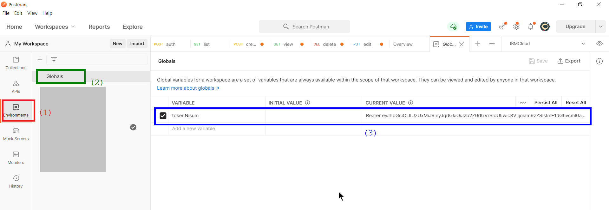
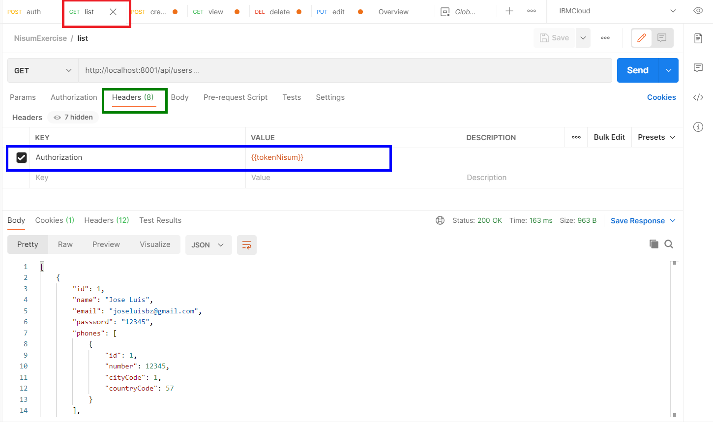
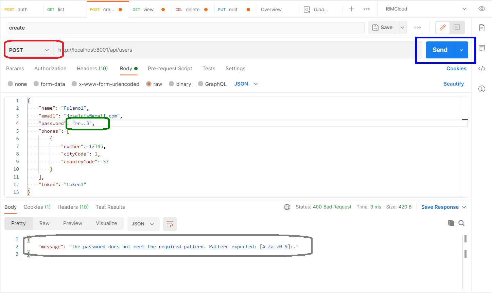
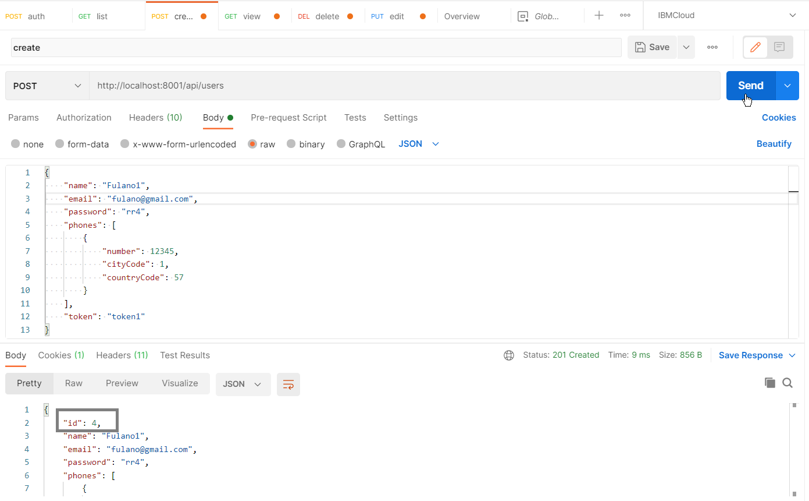
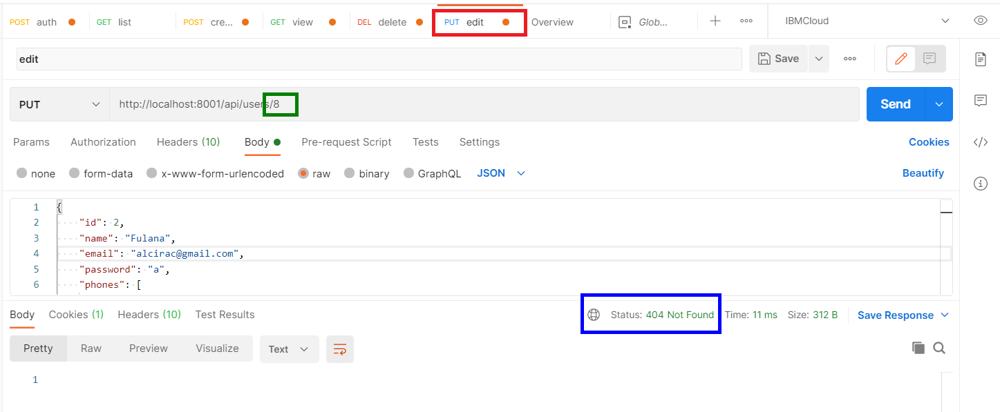
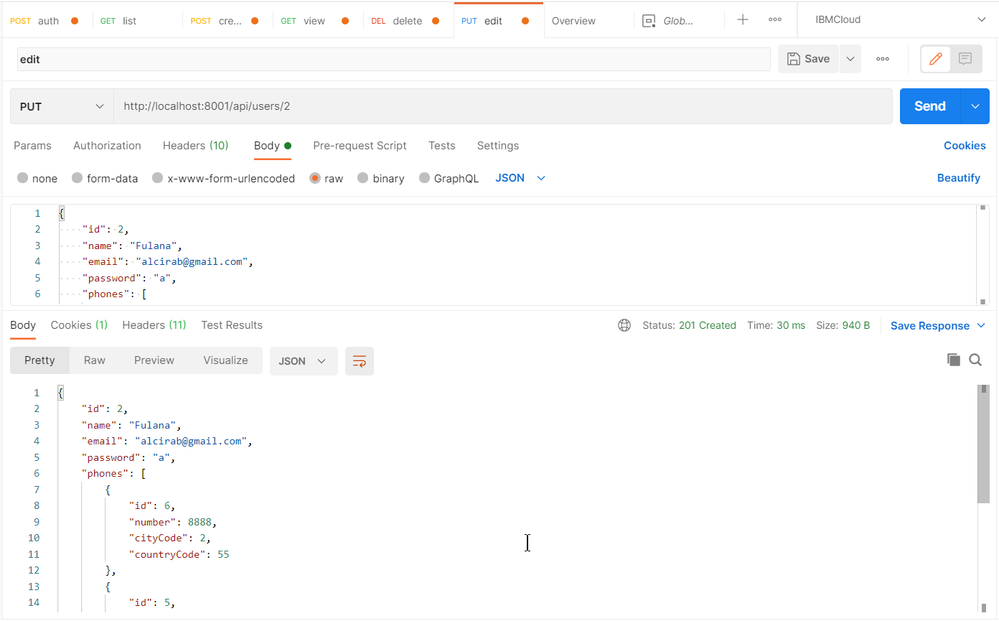
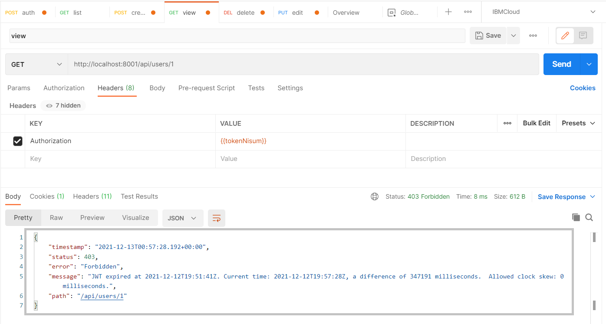
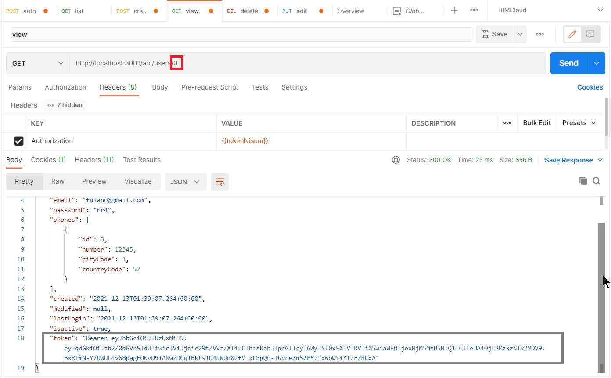

# nisumExercise
Ejercicio técnico Java - Nisum Chile

**NOTA:**
Este proyecto fue creado con **Spring Tool Suite 4** versión *4.13.0*
Se incluye el script autogenerado en el archivo *nisumExercise/CreateSchema(CodeFromConsole).SQL* para crear las tablas de la base de datos en *H2*.
```
drop table if exists phones CASCADE 
drop table if exists users CASCADE 
create table phones (id bigint generated by default as identity, city_code integer, country_code integer, number bigint, user_id bigint not null, primary key (id))
create table users (id bigint generated by default as identity, created timestamp, email varchar(255), isactive boolean not null, last_login timestamp, modified timestamp, name varchar(255), password varchar(255), token varchar(255), primary key (id))
alter table users add constraint UK_6dotkott2kjsp8vw4d0m25fb7 unique (email)
alter table phones add constraint FKmg6d77tgqfen7n1g763nvsqe3 foreign key (user_id) references users
```
Para es proyecto se usaron también datos semilla en el archivo *nisumExercise/joseluisbz-ms-usuarios/src/main/resources/import.sql*.
```
INSERT INTO USERS (name, email, password, created, last_login, isactive) VALUES('Jose Luis', 'joseluisbz@gmail.com', '12345', NOW(), NOW(), 1);
INSERT INTO USERS (name, email, password, created, last_login, isactive) VALUES('Alcira', 'alcira@gmail.com', '09876', NOW(), NOW(), 0);

INSERT INTO PHONES (number, city_code, country_code, user_id) VALUES(12345, 1, 57, 1);
INSERT INTO PHONES (number, city_code, country_code, user_id) VALUES(09876, 5, 57, 2);
```

**¿Cómo Probarlo?**

Usando **Git**, se puede clonar este repositorio:
```
git clone https://github.com/joseluisbz/nisumExercise.git
cd nisumExercise\joseluisbz-ms-usuarios
mvn spring-boot:run
```

Para probarlo se ha usado **Postman**.
En la carpeta *nisumExercise* encontrará el archivo *NisumExercise.postman_collection.json* que es una Collection de Postman, la cual se debe importar.

Aquí dos enlaces para saber como realizar una importación en Postman.
- https://kb.datamotion.com/?ht_kb=postman-instructions-for-exporting-and-importing
- https://learning.postman.com/docs/getting-started/importing-and-exporting-data/

**Pruebas en Postman**
* Probando Autenticación

.png)
En la parte izquierda seleccione *Collections*, luego la colección *NisumExercise*. Se elige el *Request* *auth*. Inmediatamente se puede hacer consumo de la API. En la parte inferior se puede ver el *Response*. Al consumir el servicio se obtiene el token, su valor, inmediatamente se almacena en una variable temporal llamada *tokenNisum*, para no requerir escribirla cuando se consuman otras API's.

.png)
Según la imagen anterior se pueden ingresar las variables requeridas por el controller de Java, para el ejemplo: *user* y *password*.


La imagen anterior muestra el *token* generado y almacenado en la variable (*Environments*, *Globals*) *tokenNisum*.

* Listando Usuarios


Dentro de todos los Requests de la colección *NisumExercise* para la api *users* en la respectiva pestaña *Headers*, encontrará una variable llamada *Authorization* cuyo valor será tomado de la variable global (o de colección) *tokenNisum* que previamente había sido asignada.

* Creando un usuario


La imágen anterior muestra que se ha tratado de crear un Usuario con un password que no cumple con el patrón asignado (variable *format.password* localizada en el archivo *joseluisbz-ms-usuarios/src/main/resources/application.properties*)


Probando la creación de usuario con los valores requeridos, se puede ver que se le asigna un nuevo *id* en la parte inferior del *Response*.

* Editando un Usuario

Al tratar de un Usuario con *id* inexistente se puede ver que retorna el código *404 Not Found*.


Si se el *id* de Usuario existe, y los campos en formato *json* son satisfechos se puede realizar la edición.

* Viendo un Usuario

Se hizo la prueba con la expiración del *token* generado por *auth*!


También se puede ver que el *token* generado se almacena a nivel de Usuario como se requirió.

